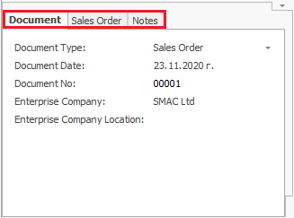

# Customize the Workspace

The workspace, i.e. the way the forms in the @@winclientfull look like, can be customized in order to serve specific needs - of a particular business process, a particular role or just a preference of a user. 
Those customized forms can be saved in so-called Views, which can be easily selected and switched during the work with the programs.

The System Forms consist of Regions and Panels. 

The Regions are separate parts of the work area that contain different Panels. They also set the borders and size of the Panels. 

 

The Panels are a number of preset fields grouped together. They are semantic units, where you can insert or get information. You can see them in a System Form, hidden, or behind other panels (with their fields hidden).

