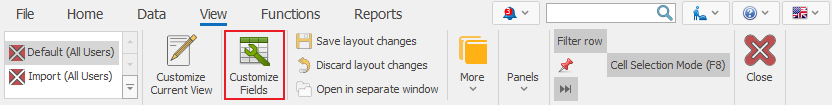
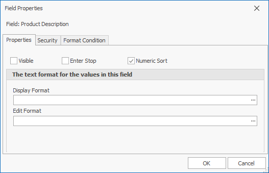
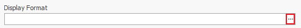
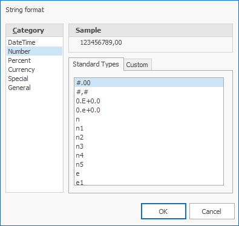
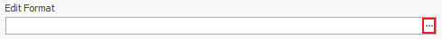
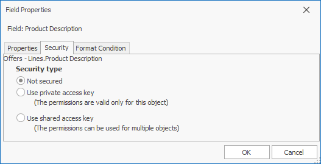
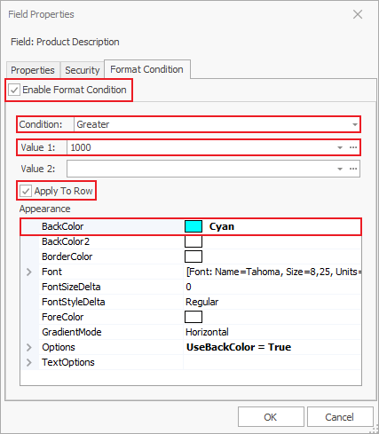

# Working with fields

<b>Fields</b> are the smallest units of information in @@winclientfull. Every field contains information, describing its essence. Modify the fields to the way you need them in the documents and navigators – they could be hidden or visible, sorted in the order you created them, formatted according to the form’s principles, or colored.  You can edit the fields in the *Change Current View* mode (you will find it automatically activated after choosing the *Customize fields* function). Access the customize fields from:

<b>Command ribbon >> View >> Customize fields</b>

Or with right-click >> <b>Customize fields</b>. 
With that, a new window opens up:

On its left side **All Fields** you will find all fields organized by panels in a tree. When you enable the *Custom properties* checkbox, you will see it as a subsection of Documents and it includes the defined custom properties for that document, if there are any.  The checkmark  indicates visible fields, while  marks hidden fields. 
With the <b>Expand All</b> button you can review all fields from the list. 

With the **Expression Fields** button, you can create and edit expression fields. 
On the right side, you can see a list of all *Visible* fields. The program organizes them in the same way as you see them on screen. Against the name of the field you will see its main settings – if it could be sorted, if it is accessible with *Enter*, if it is *Required*, and if it is *Read Only*. 

If you put a check on Enter, when you press Enter on the keyboard over a previous field, the cursor will move on to this field. When the checkmark is absent, you can access the field by pressing Tab, the arrow keys, or a mouse click, but not with Enter – the cursor will skip this field and move on to the next *Enter-enabled* field.

If you set the field to *Required*, it won’t be possible to release the document until the field is filled out. Some fields are set to *Required* by the program, so you can’t remove the checkmark and make them not mandatory.

If you mark a field to *Read Only*, it can’t be edited. It will be visible, together with its value, but the user won’t be able to change it.  

- <b>Hiding and revealing fields</b>

You can review a field by moving it from the *All fields* to *Visible fields* (from left to right). You can do this by double-clicking on the *field name* or clicking this arrow: . 
If you need to hide a field, double-click on it again or choose the analog command: .

- <b>Reordering fields</b>

You can reorder the fields by dragging them to the needed position. Press the name of the field in the *Visible fields* list on the right and hold. Then drag it to the fitting place and let it go.

You can also reorder the fields with the move up  and down 
 buttons.

- <b>Properties</b>

You can modify the visualization of data in the panels. Select a field name from the fields tree or the visible fields and click the *Properties* icon . You will see a new window opening:

The checkmarks on top are the options we’ve looked into above.  

To set the field format (number, date), click on the three dots next to *Display format*. 

In the new window, you can choose from the standard types in the program or create a custom one. You can choose the type of data on the left side of the window. You need to set formats in the standard C# way – [more information](https://docs.microsoft.com/en-us/dotnet/standard/base-types/custom-numeric-format-strings).

When you set a format, the program loads a sample text in the *Sample* field, according to the chosen format. The sample may <b>not</b> reflect all aspects of the given format.  

Similarly, you can set the format for editting – what will be visible when you click the field. Click on the button next to **Edit Format** and proceed in the way described above.

- <b>Security</b>

From the **Security** panel, you can choose the *Security type* of the field, using a *private* access key or *shared* access key. By default, it will be not secured. 

- <b>Format condition</b> 

The Format condition allows you to set up lines and fields to turn a certain color if they face certain criteria. 

1. Open the **Properties form** for the field you need to modify and go to Format condition;
2. Put a check on *Enable format condition*;
3. Choose the condition that this field needs to face; 
4. Fill out Value 1 and optionally Value 2 if the value of the colored field needs to be in a certain interval (or outside of it);
5. Set a color.

You can make some other modifications (GradientMode, TextOptions…) if you check the <b>Apply to row</b> box. This means that the entire row for that field will be colored.

