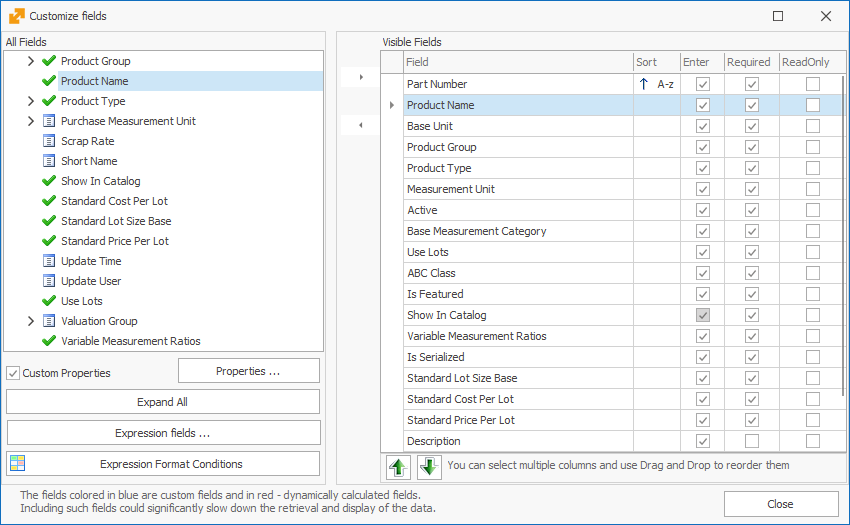

# Working with fields

The <b>Fields</b> are the smallest units of information in @@winclientfull. Every Field contains information, describing its essence. Modify the fields to the way you need them in the Documents and Navigators – they could be hidden or visible, sorted in the order you created them, formatted according to the form’s principles, or colored.  You can edit the Fields in the *Change current view* mode (you will find it automatically activated after choosing the Customize fields function). Access the Customize fields from the <b>Command Ribbon >> View >> Customize Fields</b>

Or with right-click >> <b>Customize fields</b>. With that, a new window opens up:

On its left side (<b>All Fields</b>) you will find all Fields organized by panels in a tree. When you enable the Custom Properties checkbox, you will see it as a subsection of Documents and it includes the defined custom properties for that document, if there are any.  The checkmark  indicates visible Fields, while  marks hidden Fields. 
With the <b>Expand All</b> button you can review all fields from the list. 

With the <b>Expression Fields</b> button, you can create and edit Expression Fields. 
On the right side, you can see a list of all Visible Fields. The program organizes them in the same way as you see them on screen. Against the name of the Field you will see its main settings – if it could be sorted, if it is accessible with Enter, if it is Required, and if it is Read Only. 

If you put a check on Enter, when you press Enter on the keyboard over a previous field, the cursor will move on to this field. When the checkmark is absent, you can access the Field by pressing Tab, the arrow keys, or a mouse click, but not with Enter – the cursor will skip this field and move on to the next Enter-enabled Field.

If you set the Field to Required, it won’t be possible to release the Document until the Field is filled out. Some Fields are set to Required by the program, so you can’t remove the checkmark and make them not mandatory.

If you mark a Field to ReadOnly, it can’t be edited. It will be visible, together with its value, but the user won’t be able to change it.  

- <b>Hiding and Revealing Fields</b>

You can review a Field by moving it from the All Fields to Visible Fields (from left to right). You can do this by double-clicking on the Field name or clicking this arrow: . 
If you need to hide a Field, double-click on it again or choose the analog command: .

- <b>Reordering Fields</b>

You can reorder the Fields by dragging them to the needed position. Press the name of the Field in the Visible Fields list on the right and hold. Then drag it to the fitting place and let it go.

You can also reorder the Fields with the move up  and down 
 buttons.

- <b>Properties</b>

You can modify the visualization of data in the Panels. Select a Field name from the Fields Tree or the Visible Fields and click the Properties icon . You will see a new window opening:

The checkmarks on top are the options we’ve looked into above.  

To set the field format (number, date), click on the three dots next to Display Format. 

In the new window, you can choose from the Standard Types in the program or create a custom one. You can choose the type of data on the left side of the window. You need to set Formats in the standard C# way – [more information](https://docs.microsoft.com/en-us/dotnet/standard/base-types/custom-numeric-format-strings).

When you set a format, the program loads a sample text in the “Sample” field, according to the chosen format. The sample may <b>not</b> reflect all aspects of the given format.  

Similarly, you can set the format for editting – what will be visible when you click the field. Click on the button next to Edit Format and proceed in the way described above.

- <b>Security</b>

From the Security panel, you can choose the Security type of the Field, using a private access key or shared access key. By default, it will be not secured. 

- <b>Format Condition</b> 

The Format Condition allows you to set up lines and Fields to turn a certain color if they face certain criteria. 

1. Open the Properties Form for the Field you need to modify and go to Format Condition;
2. Put a check on “Enable Format Condition”;
3. Choose the Condition that this field needs to face; 
4. Fill out Value 1 and optionally Value 2 if the value of the colored field needs to be in a certain interval (or outside of it);
5. Set a color.

You can make some other modifications (GradientMode, TextOptions…) if you check the <b>Apply To Row</b> box. This means that the entire row for that Field will be colored.

