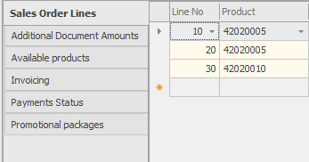

# Working with panels 

The panels are logically grouped sets of fields. They are part of the forms, which contain information from different logical entities in @@winclientfull. The panels are usually combined in regions. If you need to edit the panels, the *Customize Current View* mode should be active.

> [!NOTE]
> If you need to edit the panels, the *Customize Current View* mode should be active.

## Showing and hiding panels

If you would like to show or hide some panels, go to 

**Command ribbon >> View >> Visible panels**.

The currently visible panels are marked with a tick in front of them.

 
If you need to hide a panel, click on its name in the list – the panel will get hidden and the tick in the list will be removed. The procedure for showing panels is identical.

## Arranging panels

You can move the panels from one region to another by dragging them. In a single region you could have more than one visible panels. Only one of the panels will be focused and its fields will be shown. If you would like focus another panel, you could click on its panel name. You will initially see the panel, which was visible when the *View* was saved. If you would like to change the initially visible panel, you could enter the *Customize Current View* mode, open the desired panel, and then save the change. 

You could set where in the region the panels’ names should appear. This happens when you right click the name of a panel within a region and select one of the options: Top, Left, Bottom, Right:

If you select Left, the panel names will move from the top side to the left side of the region:
 

In a similar way, you could position the panel names on the right or on the bottom of the region.

## Floating panels

By default, the panels reside within a region in the main form. When necessary, you could pop the panel out in a special form. In such a case, they are called 
*floating panels*.

A panel becomes *floating* when you right click on its name and from the menu you select **Floating window**.
 

 
Following is an example of a *floating panel*:

The *floating panels* are separate windows and you could position it wherever needed, not taking the regions sizes and positions into account.

If you would like to take the panel back to the main system’s form, right click the panel name and select Docked. If you save the *View* with *floating panels*, these panels will be floating again when the *View* is open.
