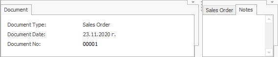

# Working with regions

The *regions* are places on the workspace that contain [panels](https://docs.erp.net/winclient/introduction/workspace-customization/working-with-panels.html). You can change their size and position for each system form separately.  
To personalize the regions, you need to have *Customize Current View* mode activated.

 

In every region, you have the option to position one or multiple panels.

You can add, remove, extend, or shrink the regions. You can also add more regions with this arrow .

If you need to remove a region, you can use the separation line between the two panels.  

## Create a new region

1. Hover over the arrow at the top or right corner to create a new region . The cursor will change;

 

2. Click on the button and drag down or to the left, until you reach the size you need. This will take up space from the region you dragged towards; 
3. Release the mouse button and you will see the region created.

## Remove a region

You can remove regions by dragging the line up or to the right: 

1. Click on the left dividing line of the region you need to remove.

2. Drag the line to the right until the cursor changes.

3. When you drop the line, the region will disappear. 

## Resize a region

Resize a region by dragging the dividing line between that region and another one in any direction

1. Click on the dividing line from the side you need to edit.

2. Drag the line to the size that you need.

3. Release the line and the region will change.

## Fix a region

When resizing regions (and also resizing the window of the @@winclientfull), you set which region will change its size and which one will remain with a fixed size. 
Visually we show this with the button  at the top right corner, and respectively  at the bottom left corner. 
The tips of the arrows point at the panel with the fixed size. To change that:

1. Hover over the respective button (at the top right or bottom left): 
2. The mouse cursor will change – the black arrow indicates the fixed region: 
3. When you click with the mouse (without moving it), you can choose which region to leave as fixed: 
You can check the fixed region when you shrink the whole program window. See which regions change in size and which don't.
