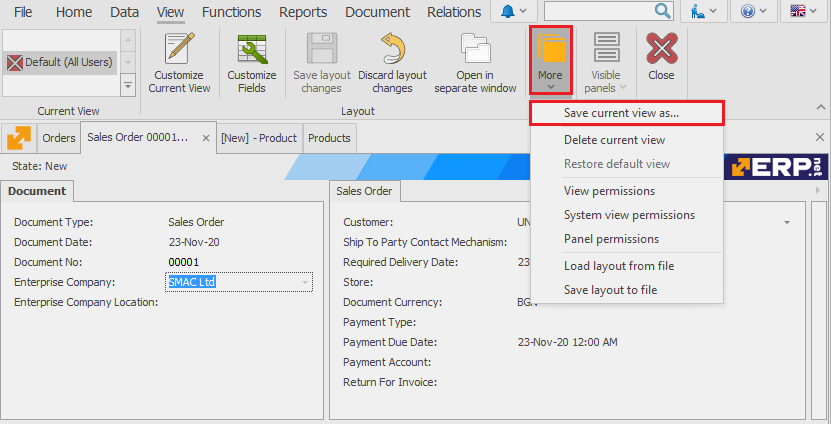
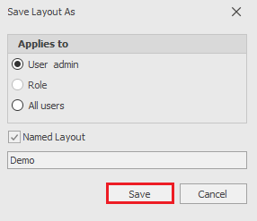

# Working with views

When working with the system, you may need to see the same information in different ways depending on the use case. This is why you can customize the system form’s appearance for it to fit your current needs. To protect your time, you can save the customized appearance under a specific name so that you can open it again later. This is called a View. The View is a specific named appearance of a system’s form. You could have multiple Views for the same form and each of them could be easily opened with a single mouse click.

To customize the View, you need to have the form in the Customize Current View mode and possess the needed rights (in the current article we assume that you have the rights to perform the described actions).

Selecting the desired View is done by clicking it in the Command Ribbon >> View. There is a list at the left hand side with all saved views (if there are any). The View is changed by clicking on the desired View:

When there are more saved Views than the section can show (4, or 2 when the window is smaller), then the whole list could be seen by clicking the button .

## View types

ERP.net has different types of Views – Standard and Named, for a User, Role or All Users.

There are two Standard Views – one for All Users and one for the specific User. In the Standard View it is recommended to save the View that is needed most often. The Named Views are used for special use cases and there could potentially be an unlimited (but still reasonable) amount of them.

The Views, created by a User (in brackets behind the name of a View you can see the User who created it), could be opened and edited only by that specific User. They are not visible to the rest of the users in the system (including administrators). The Views, assigned to a Role (in the form “View name (Role name)”) could be opened and edited by any user, who has that role assigned or by an administrator. The All Users Views could be opened by all users of the system and edited only by administrators.

## Saving views

You can save your modified View using one of the following methods – by clicking the “Save layout changes” button or by using the “Save current view as…” option.
The function “Save layout changes” is used by clicking the respective button in the View tab of the Command Ribbon. This way the changes are saved in the currently selected View.
 

 
When it is necessary to save the changes in a View, different than the currently selected one, you could use the option “Save current view as…” from the Command Ribbon >> View >> More >> Save current view as…

 
This option opens a new dialog window where you can set your saving preferences. If you would like the View to be named, click the respective “Named Layout” checkbox and give it a name. Otherwise, the View will be saved as a Standard View.

If the View is not specifically saved, the system would ask if you would like to save it when closing the form. If not, the changes would be lost.

## More actions

Other actions you could potentially perform with Views (from the Command Ribbon >> View >> More)

- Delete current view – deletes the currently selected view. This function is irreversible
- Restore default view – restores the Standard view
- View permissions – allows you to view and/or change the View permissions
- System view permissions – allows you to view and/or change the System view permissions
- Panel permissions – allows you to view and/or change the Panel permissions
- Load layout from file – works when there is a previously saved layout. The system applies it to the currently selected View of the form. It could only be used for the same form (which means you cannot load a Sales form View on the Invoices form)
- Save layout to file – saves the currently configured view in a file which could be sent over (via email or IM programs) and/or loaded in another database (for the same form).
