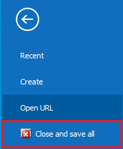

# File page

In the **File page**, you have quick access to: recently opened documents, opening documents by URL, centralized document creation, and user interface settings.

You can access the **File page** from any location in the program.

 

You will find that the **File page** is similar to the **Main menu** in its structure. On the left, you can open the sections, and on the right, you’ll see the elements of the chosen section.  

## Recently opened documents

By clicking the <b>Recent</b> button, you will see a list of the lately used forms:

 

You can easily access the documents again with a click on the desired document.

## Create new document

With the <b>Create</b> button, you have the option of central document creation from any location in the program. When you choose this function, you have a list of all document types. You can easily find the one you’re looking for, as we organize them into functional areas (just like in the **Main menu**):

 

If you want to create a document, click on its name in the list.

## Open URL

With the <b>Open URL</b> button, you can directly open a document using its unique URL address:

 

You can receive or send the address through an e-mail, real-time communicators, etc. If you want to open a form using its URL, paste the address in the field on the right side of the screen and then click on the arrow (or press Enter).  
You can check the URL address in the <b>Properties</b> button.

## Close and save all

The <b>Close and save all</b> button allows you to close all opened forms with one click. It is ideal for when you have many forms opened at the same time:

 

When you click on the button, the program attempts to close all forms. The forms that could be closed will be closed.  
In case that any of the forms requires your intervention (saving the view, having errors during saving), you will receive a notification. 

## Delete 

You can delete some of the forms (templates for documents routes, characteristics, etc.). To delete a form, click on the respective button:

 

## Log Off

The <b>Log Off</b> button allows you to end your work in the system. The program remains open, available for another user to log in with their credentials.

 

## Exit

With the <b>Exit</b> button, you end any work on the system and completely close the program.

 

## Print, Properties, Send

The *File page* is another place, where you can print a document, review its properties, or send it via e-mail. These buttons have analogs on the command ribbon. 

 

Using the <b>Send as attached PDF document</b> function, you can send a document with a single mouse click. It is also going to save the document as a temporary PDF file, using a default template for the printout. After that, an email will be created for you through the incorporated into @@winclientfull mail client. The letter already contains the attached file and receiver (we take the information from the contact data for the counterparty of the document). In case of a successfully generated letter, you will be able to see the operation, saved as a printout in the *Print* panel.

## Settings

You can personalize your workflow in the system according to your preferences or choose from the given preset options in the <b>Settings</b>. 

 
