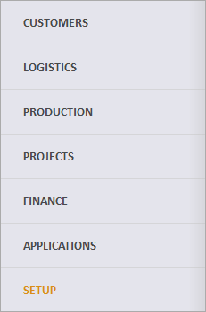

# Main Menu

Using the <b>Main Menu</b>, you can easily navigate the different modules and open navigators or documents. You have access to it at any time through the @@winclientfull icon . You will only see the Forms that you have access to.

On the left, you will see the 6 main sections, together with the Setup and the program modules,  spread across the sections.  
When you  enter the program for the first time, you will see the first module open by default.  
Each following time you will see the last used module open. 

On the right side, you will usually see three subsections: Documents, Reports, and Definitions.  
You can create and use them from within the respective module.  
Enther a Navigator or a Definition by clicking on its name or the icon in front of it. 

