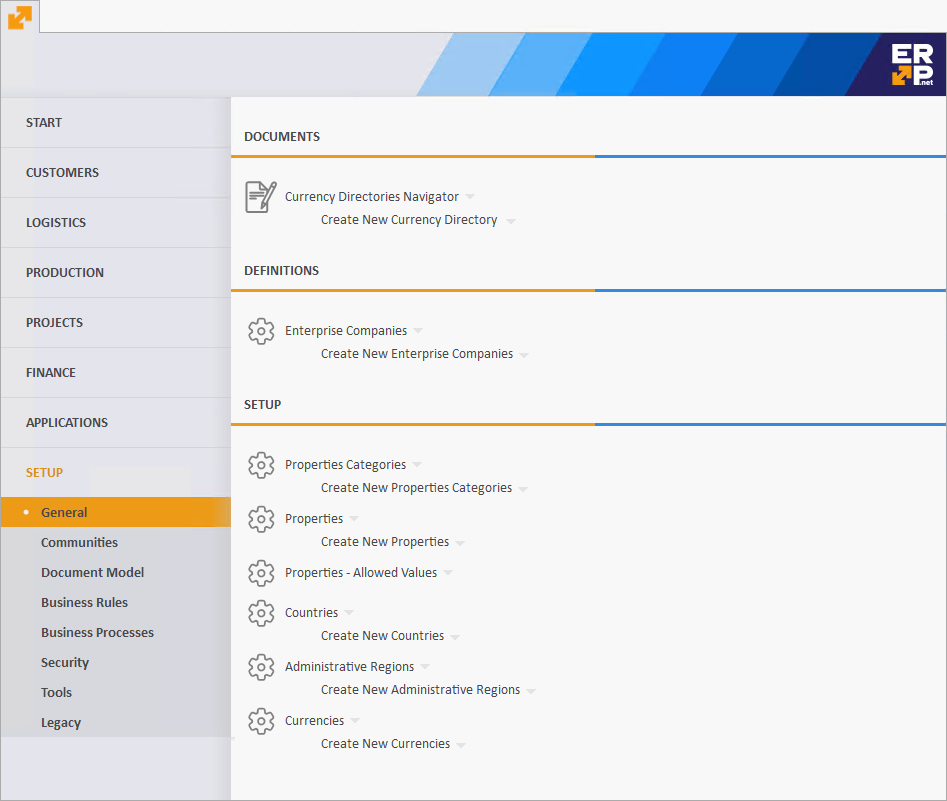

# Main menu

The *Main menu* is the default page that will open after starting the @@winclientfull. Using it, you can easily 
navigate between the different modules or to open navigators and documents. You have access to it at any time through 
the @@winclientfull icon . 

> [!NOTE]
> According to your security access level and settings you will only see the sections you have access to.

## Menu navigation

On the left you will see the menu navigation, containing the different application sections. For convenience, 
they are grouped into several top-level groups (also called _tabs_):
* `START` - provides fast access for commonly used pages which summarize data.
* Main program modules. Each one in a separate group.
* `SETUP` - workflow, system and application specific tuning.

Each group contains the actual application sections. When you click on a group, it will expand and its available 
sections (i.e. modules) will appear. You can see in the picture below- the `CUSTOMERS` group is selected and its related 
modules are shown beneath.

> [!NOTE]
> When you start @@winclientfull for the first time, you will see the first module opened by default 
> (`CUSTOMERS->SALES`, according to the picture above). Each following time the application will 
> remember the last used module and will select it automatically after start.

## Menu page

On the right you can see the rest of the page- the contents of the selected module from the navigation. The content is 
usually divided into three subsections:
* Documents
* Reports
* Definitions

Below each subsection there is list of links, which represent specific actions in the context of the selected module.
E.g. you can open a `Navigator`, create a new document or open a specific report.

## START

`START` is the first available group in the menu navigation. It differs from the other groups in the following aspects:
* It doesn't contain application modules, but direct links to the most commonly used summarization panels.
* It is fully customizable! You have a set of possible panel types and you can choose which ones will be included.
* Each panel opens in the same page. You don't need to switch between different tabs.

Due to the fact that the *Main menu* supports `Views`, you can customize the contents of the `START` group.
From the list with available panels you can select the ones you wish to be part of the `START`.

> [!NOTE]
> If there are no visible panels, the `START` group will be empty and therefore will not be displayed.

For more information how to customize a `View`, please check out our separate docs topic: 
**[Customize the workspace](https://docs.erp.net/winclient/introduction/workspace-customization/index.html?q=Customize%20the%20workspace) / [Working with views](https://docs.erp.net/winclient/introduction/workspace-customization/working-with-views.html?q=%20Working%20with%20views)**.

In addition to the customization, some panels content depends on the `View`, of which is part of. An example for this
is the `Dashboard` panel. You can create multiple views with totally different set of tiles for each `Dashboard`. It
will be restored the way you configured it each time you change the current `View`.

In contrast, some other panels don't work this way. E.g. the `Timeline`- will show its content, regardless of the current `View` and
any other customizations.

> [!NOTE]
> When @@winclientfull starts for the first time, the `START` group will not show. This is because 
> by default there are no visible panels. They need to be configured initially in the way you want.
