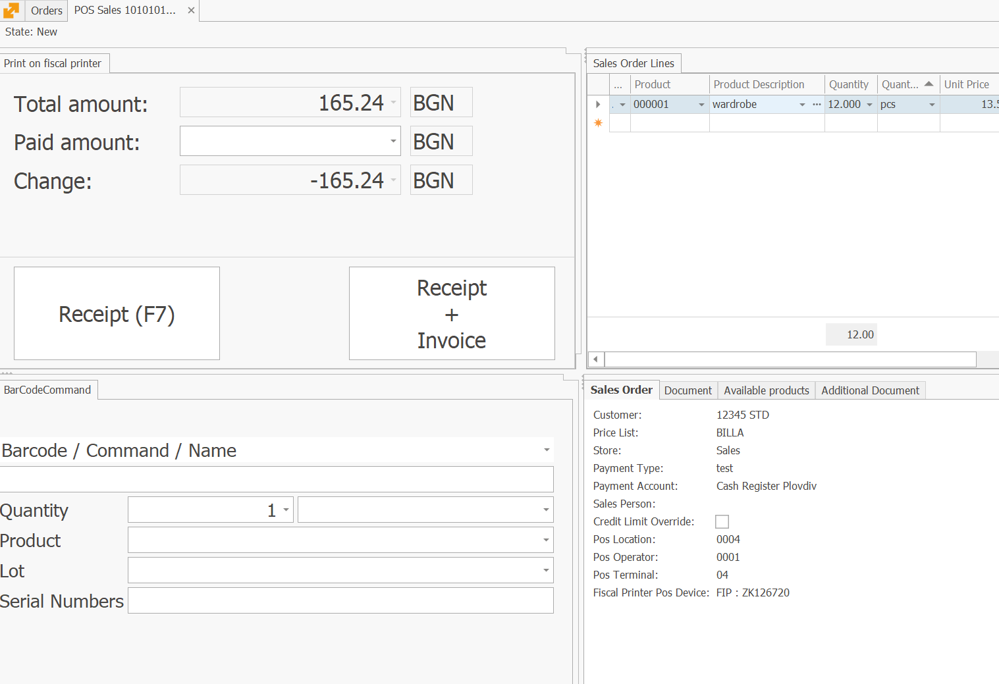

# Print of fiscal device panel

In Sales and Payments, there is a 'Fiscal Printer Print' panel that enables the fiscalization of sales and payments. The panel contains two buttons:

Receipt (F7) - which prints a fiscal receipt on the fiscal device.
Invoice + Receipt - which allows for easy issuance of an invoice for the current sale. It appears in the panel only when it is for a sale.

The button Invoice + Receipt operates in several ways:

If a receipt has not yet been printed, the receipt is first printed and then the invoice is created and displayed on the screen.
If the receipt has already been printed, it simply creates the invoice and displays it on the screen.
If an invoice already exists or more than 5 days have passed since the receipt was printed, the button is inactive.

The button's functionality heavily depends on the configuration of the  document flow. It is expected that there will be a planned store order  in the flow, which is released first. Afterward, a invoicing order with a configured manual document route for invoice creation is sought out.




```

```
