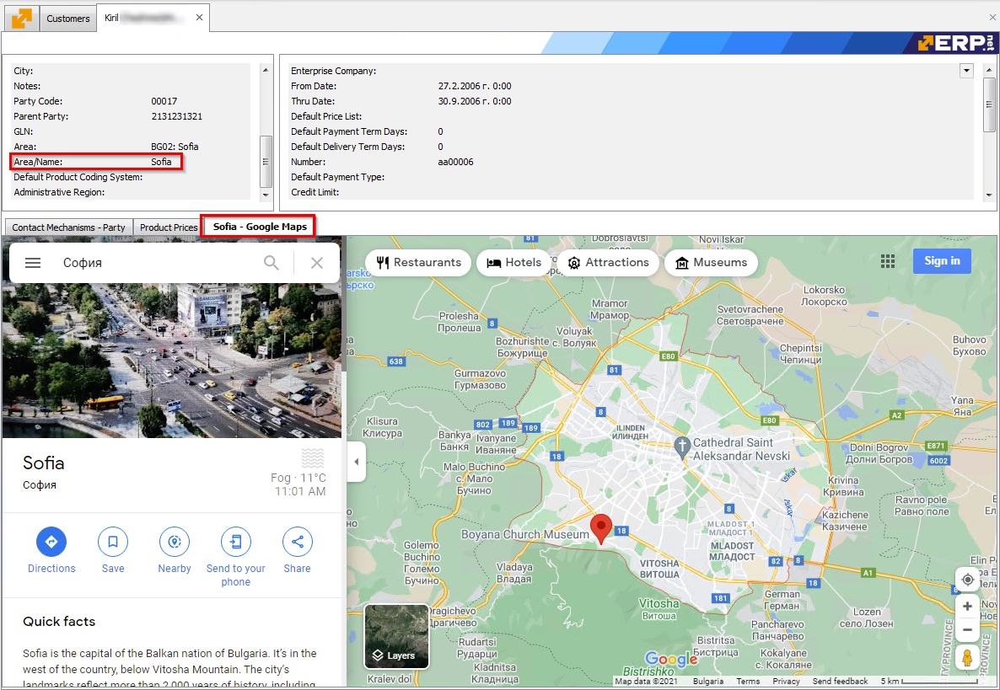
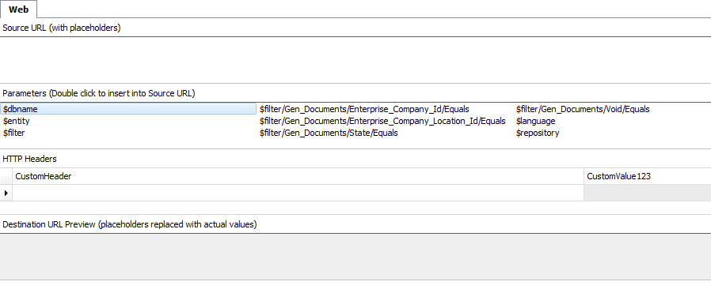
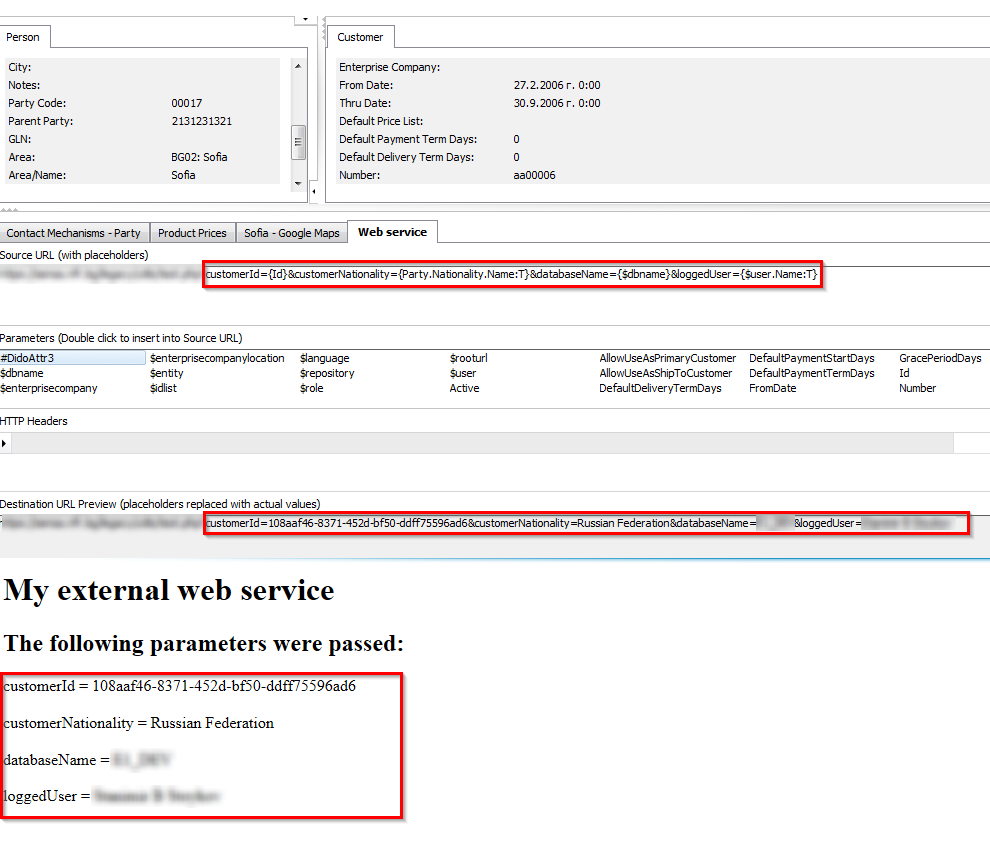
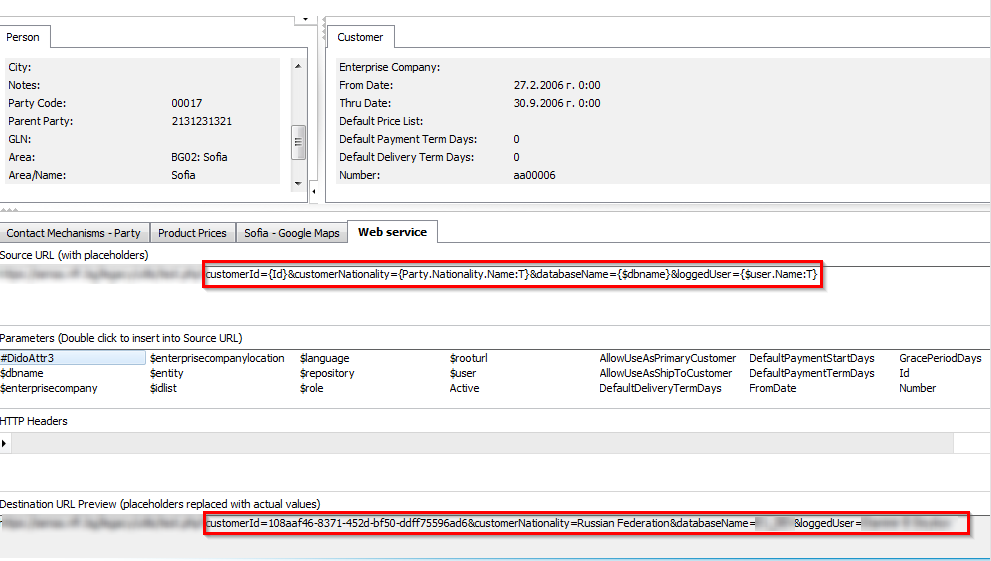

# Web browser

They are everywhere. Each form in @@winclient supports up to 3 instances of a web browser panel. You can show them in the usual way - [Customize the workspace](https://docs.erp.net/winclient/introduction/workspace-customization/index.html?q=Customize%20the%20workspace) / [Working with panels.](https://docs.erp.net/winclient/introduction/workspace-customization/working-with-panels.html?q=Working%20with%20panels)


Their purpose is quite simple - access and interact with an external web service directly from the @@winclient. See below for an example picture of a customized web browser panel. It's configured to open a location in google maps - the location corresponding to the specific customer record.




This is a very simple example of use, but you can customize the panels to suit your needs. In the next section you can see how a web browser panel can be configured.


## Setup

When a web browser panel is in configuration mode, it looks like this:



> [!NOTE]
> If you need to customize a web browser panel, the Customize Current View mode should be active.

Several additional regions appear to help you configure it. Their names are self explanatory and the main idea is to specify the destination address you want the web browser to open.
An important detail here is that if the address is not constant (e.g. when you just want to open "google.com") and depends on certain parameters, then the [string interpolation](https://docs.erp.net/tech/advanced/string-interpolation/index.html) takes action - integrated functionality in @@erpnet.

In the example with the panel above that shows google maps, the source URL used is:

https://www.google.com/maps/place/{Party.Area.Name:T}

which is interpolated to:

https://www.google.com/maps/place/Sofia

That is, it doesn't simply visualize a location on the map, but one that is set on the customer itself.

For more information on string interpolation you can read in our [separate topic in the documentation](https://docs.erp.net/tech/advanced/string-interpolation/index.html).

### Source URL

This is the original (source) target address that will be interpolated. Here you can specify additional parameters that are required (as the location in the example above). Of course, if you just type "google.com" and save the changes, this panel will simply open the site.

### HTTP headers

Sometimes, usually for web services, you need to specify additional value(s) in the request header. E.g. a secret token, api key, etc... Here you can set all additional headers as they are required.

### Parameters

Contains a list of possible parameters that you can use in the source URL. When you double-click on the desired one, it will be inserted where you are positioned in the source URL input.

### Destination URL

Practically, the same one as the Source URL, but interpolated. This will be the actual URL, that web browser will open.


## Advanced example

Some web services require multiple additional parameters, which must be passed in the URL. The picture below demonstrates it.



The external web service in the example expects several parameters and prints them on the screen. We can obtain these parameters only via string interpolation. Take a closer look at picture below - the source URL and how it's interpolated.



As you see, we need to pass the customer's id, its nationality, the database name and the name of the currently logged user.

Here is the source URL (string interpolation ready):

```
https://mywebservice.com?customerId={Id}&customerNationality={Party.Nationality.Name:T}&databaseName={$dbname}&loggedUser={$user.Name:T}
```

And the result from the string interpolation:
```
https://mywebservice.com?customerId=108aaf46-8371-452d-bf50-ddff75596ad6&customerNationality=Russian Federation&databaseName=DEMODB&loggedUser=John Smith
```
