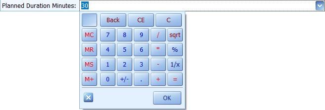

# Activity
The Activity document is used to **enter** a specific activity and **mark** its result.

To create an Activity, go to <b>Customers  >>  Contacts & Tasks  >> Create New Activity </b>.
 

Let's fill in the following fields:

-	<b>System Type </b> - you can set it as either **Communication**, **Meeting** or **Task**.
 

-	<b>Subject </b> - here, write a short text that will become the **topic** of the activity.
 

-	<b>Start Time </b> - this is where you set the date and time for **starting** the activity.
 

-	<b>End Time</b> - this is where you set the date and time for **ending** the activity. The *Deadline Time* field will be calculated automatically
 

-	<b>Deadline Time</b> - define the planned **duration** in minutes. The *End Time* field will be calculated automatically.
 

After filling in the data, **release** the document
 

To view all created Activities, go to <b>Customers  >>  Contacts & Tasks  >>  Activities Navigator</b>.

- Press the **Display** button.

- All created activities will be loaded.
 

If you **double-click** a selected activity, you can open and view it.

