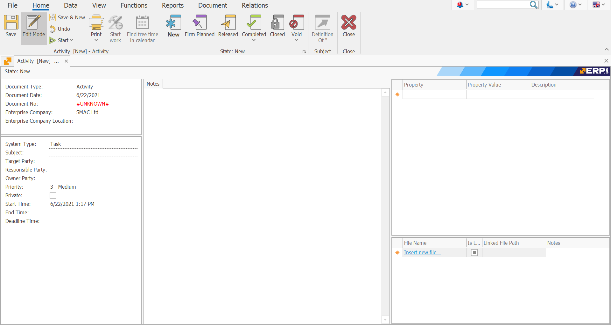

# Activity
The Activity document is used to enter a specific activity and mark the result of it.
To create “Activity” go to <b>Customers  >>  Contacts & Tasks  >> Create New Activity </b>
 

Fill in the following fields:
-	<b>System Type </b> - you can set whether to be Communication, Meeting or Task.
 

-	<b>Subject </b> - you can enter a short text that will be the topic of the activity.
 

-	<b>Start Time </b> - you can set the date and time for starting the activity.
 

-	<b>End Time</b> - you can enter the date and time for ending the activity, the Deadline Time field will be calculated automatically
 

-	<b>Deadline Time</b> -  you can enter the planned duration in minutes, then the End Time field will be calculated automatically.
 

## After filling in the data Release the document.
 

##To view all created Activities:
Go to   <b> Customers  >>  Contacts & Tasks  >>  Activities Navigator  </b>
Press the Display button.
All created activities will be loaded.
 

By double-clicking on the selected activity, you can open it to view it.

