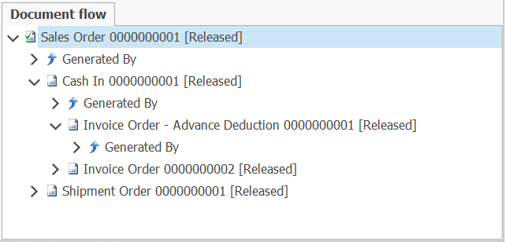
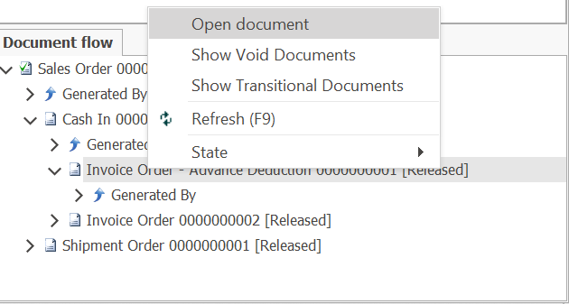

# Document Flow

According to the settings that are set, after the release of a document, the next document is generated, and all related documents form a tree structure called a document stream.

The document flow can be viewed in the Document Flow panel, which is standard for all types of documents. A tree structure always starts from the current document. In it, you can see how was created the current document - his parent document, as well as all the documents that were created after him - subdocuments.

To open a document, right-click and select "Open Document".

 

 

