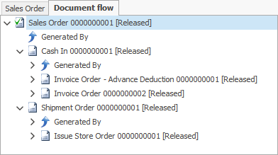

# Document flow

According to the settings in place, once a document is released, the **next** will be generated. 

All related documents form a tree structure called a **document stream**.

A tree structure always starts from the current document. The document stream can be viewed in the **Document flow** panel, which is standard for all types of documents. Inside, you can see how all documents were created. These include the current document, its parent document, and all subdocuments.

To open a document, right-click and select **Open document**.

 

 

