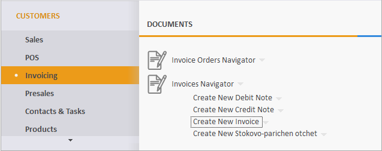
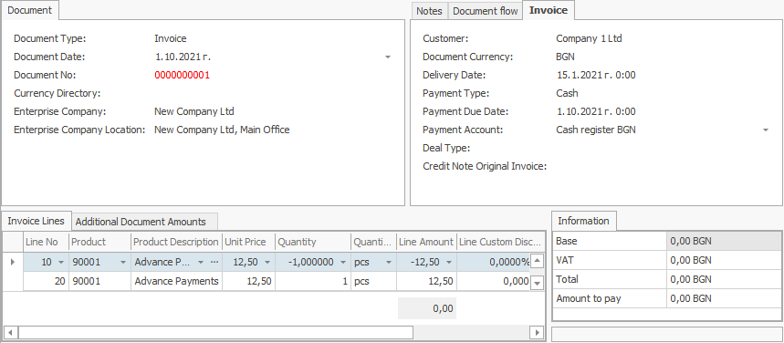

# Invoice order

An invoice order is an **intermediate** document between a **[sale order](https://docs.erp.net/winclient/step-by-step/sales-order.html)** and a **[sales invoice](https://docs.erp.net/winclient/step-by-step/sales-invoice.html)**. 

The standard model of work is to generate an invoice order from a sale order.

When creating the document, the rows from the sale order are automatically **copied** to the rows of the invoice order.

 
As a result, we get an **invoice document**.

