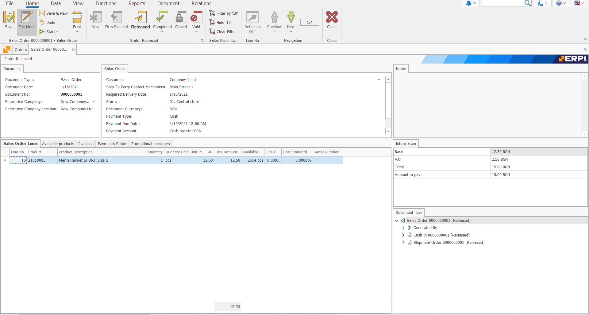
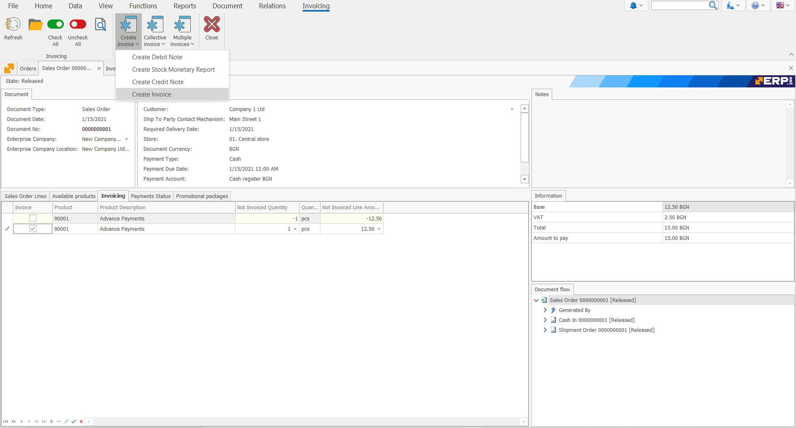
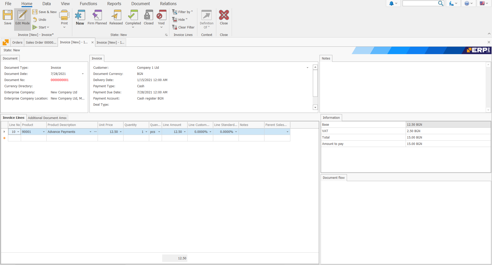

# Invoice Order

An Invoice order is an **intermediate document** between a Sale Order and an Invoice. 

It indicates that an **invoice** must be created. 

The standard model of work is to **generate** an Invoice Order from the Sale Order. When creating the document, the rows from the Sale Order are automatically **copied** to the rows of the Invoice Order. 

As a result, we get an **Invoice document**.

 

 

