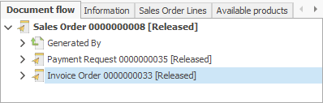

# Invoice order

An invoice order is an intermediate document between a **[sales order](https://docs.erp.net/winclient/step-by-step/sales-order.html)** and a **[sales invoice](https://docs.erp.net/winclient/step-by-step/sales-invoice.html)**. 

The standard model of work is to generate an invoice order from a sales order.

To create the document, go to the *Document flow* panel and locate the invoice order.

Right-click it and select *Open document*.

The rows from the sale order are automatically copied to the rows of the invoice order.

As a result, we get an invoice document.

