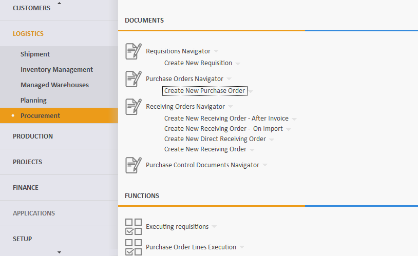
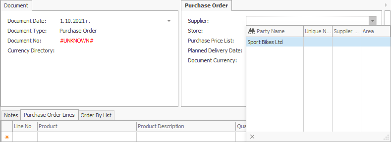
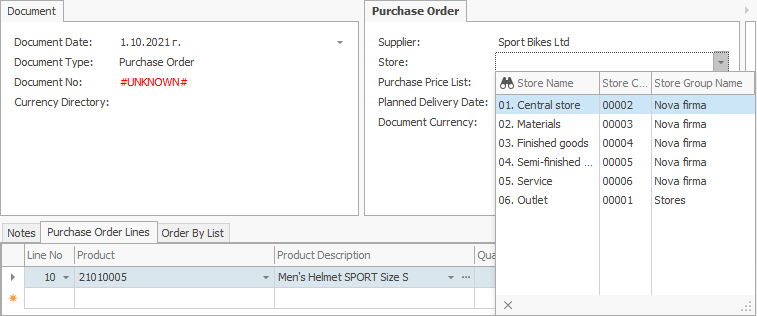
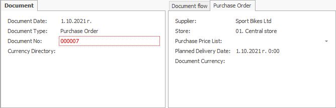
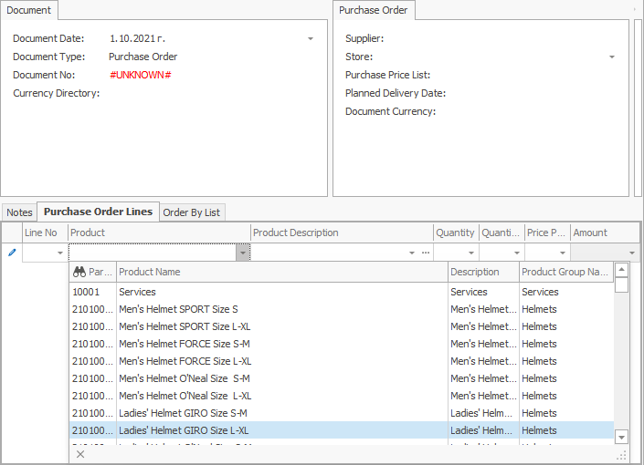
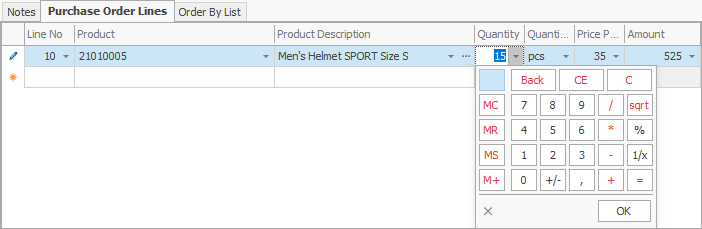
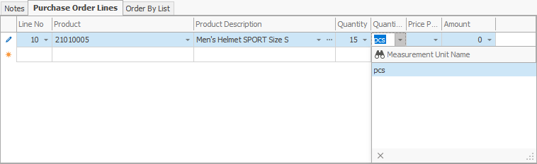
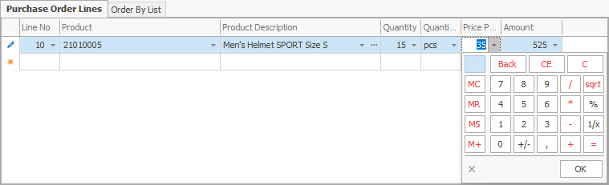
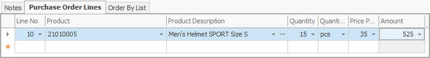
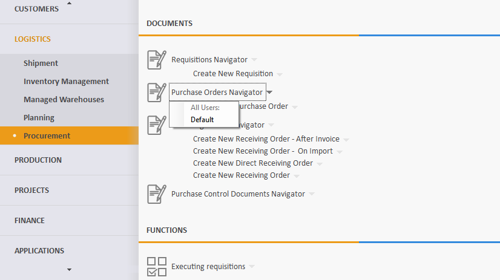

# Purchase order

A purchase order document is used to obtain goods, products and materials by purchasing them from an external supplier.

To create it, go to **Logistics >> Procurement >> Create new purchase order.**

Let's fill in the following fields:

- <b>Supplier</b> - this is the supplier from which you plan to buy the goods.
 

- <b>Store</b> - this is the store in which the goods will be credited. 
 
If the field is left blank, a store can be found for each item in the *Purchase order lines* panel.
 

- <b>Document No</b> - here, indicate the number of the purchase order, if available.
 

- <b>Product code</b> - from the dropdown, select the product for purchase.
 

- <b>Product Name </b> - if you choose the code, this name is generated automatically.

- <b>Quantity </b> - this is the purchased quantity.
 

- <b> Measurement Unit Name </b> - here, indicate the unit of measure of the purchased quantity.
 

- <b>Unit price</b> - this is the price unit of the purchased quantity. 
 

- <b>Amount to pay</b> - by default, this is a product of the unit price and the quantity. 
	
Other values lead to a recalculation of the unit price.

 
After filling in the data, **release** the document.
 

According to the standard operating model, the system is set to continue with a **[receiving order](https://docs.erp.net/winclient/step-by-step/receiving-order.html)**.

To view all issued purchase orders, go to <b>Logistics >> Procurement >> Purchase orders navigator</b>.

- Press the **Display** button.

- A list of all purchase orders will appear.
 

If you click the selected order, you can open and view it.

