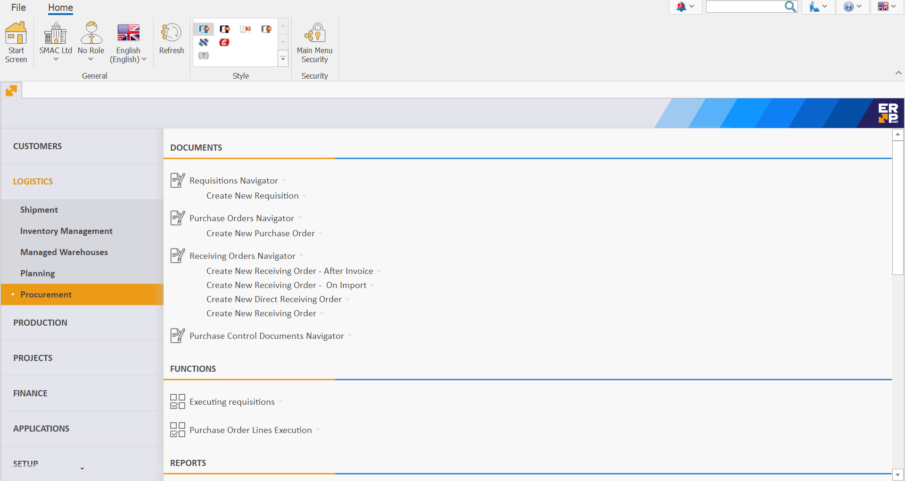
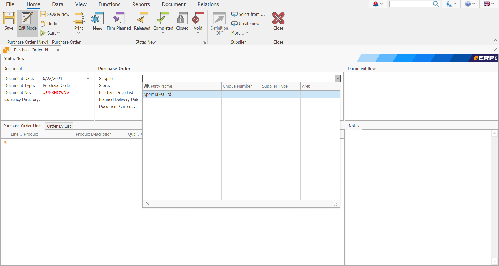
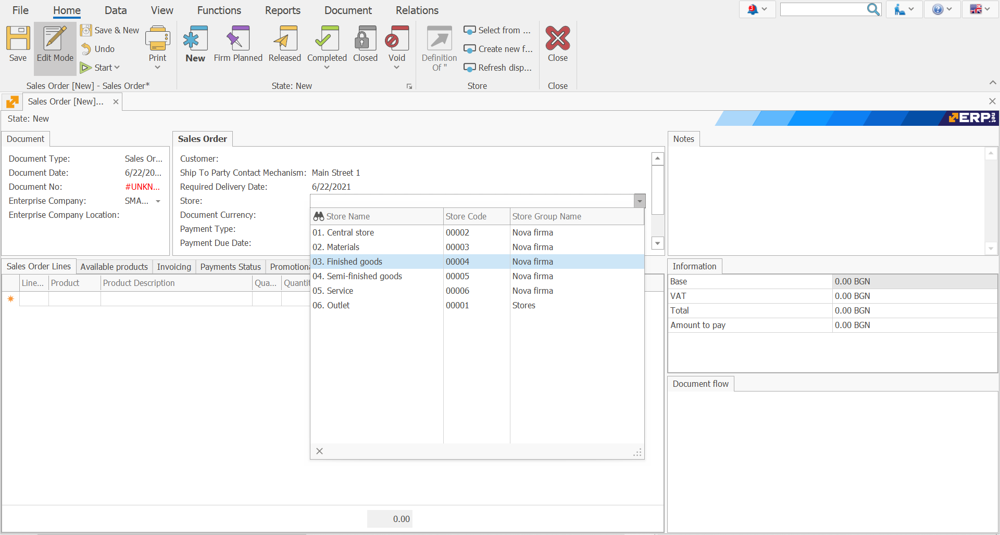
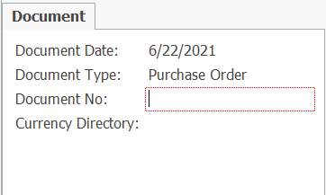
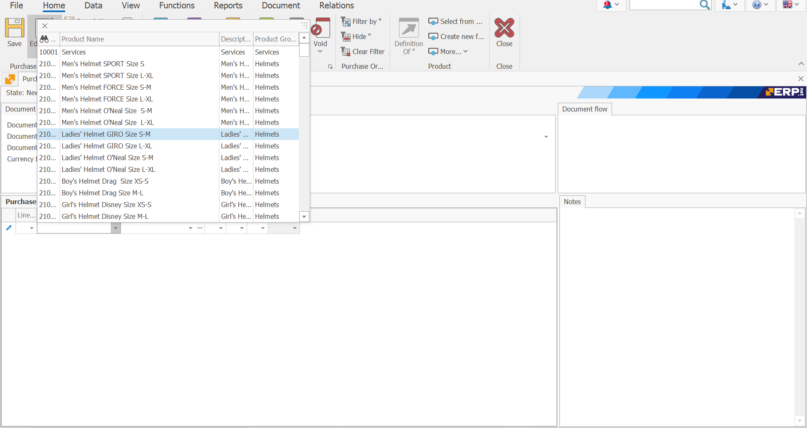
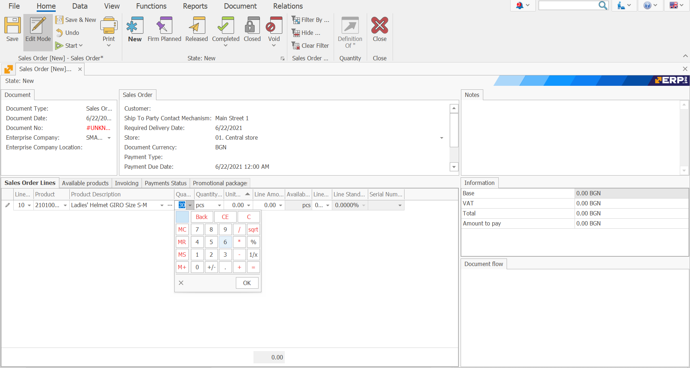
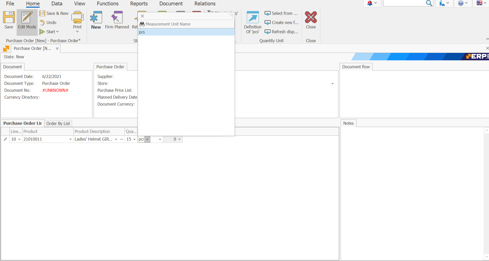
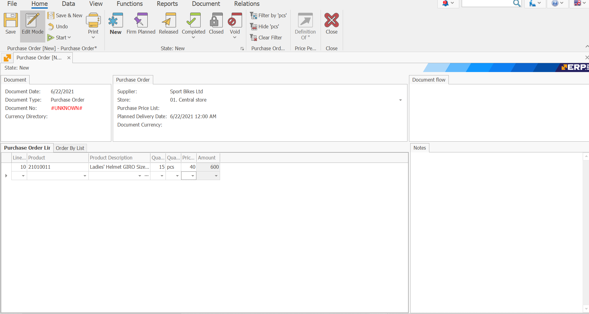
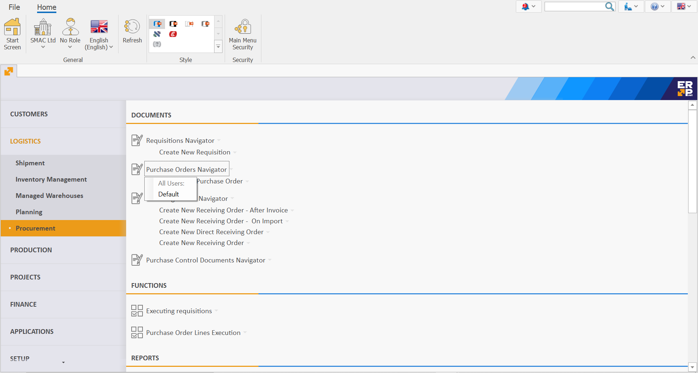

# Purchase Order

The Purchase Order document is used to **obtain** goods, products and materials by purchasing them from an **external supplier**.

To create a Purchase Order go to <b>Logistics >> Procurement >> Create New Purchase Order</b>.

Let's fill in the following fields:

- <b>Supplier</b> - this is the supplier from which you plan to buy the goods.
 

- <b>Store Name</b> - this is the store in which the goods will be credited. 
 
If the field is left blank, a store can be found for each item in the **Purchase Order Lines** panel.
 

- <b>Document No</b> - here, indicate the number of the purchase order, if available.
 

- <b>Product code</b> - from the dropdown, select the product for purchase.
 

- <b>Product Name </b>- if you choose the code, this name is generated automatically.

- <b>Quantity </b> - this is the purchased quantity.
 

- <b> Measurement Unit Name </b> - here, indicate the unit of measure of the purchased quantity.
 

- <b>Unit price</b> - this is the price unit of the purchased quantity. 
 

- <b>Amount to pay</b> - by default, this is a **product** of the unit price and the quantity. 
	
Other values lead to a **recalculation** of the unit price.
 

After filling in the data, **release** the document.
 

According to the standard operating model, the system is set to **continue** with a [Receiving Order](https://github.com/ErpNetDocs/winclient/blob/master/step-by-step/receiving-order.md).

To view all issued Purchase Orders, go to <b>Logistics >> Procurement >> Purchase Orders Navigator</b>.

- Press the **Display** Button.

- A list of **all** Purchase orders will appear.
 

If you **double-click** the selected order, you can open and view it.

