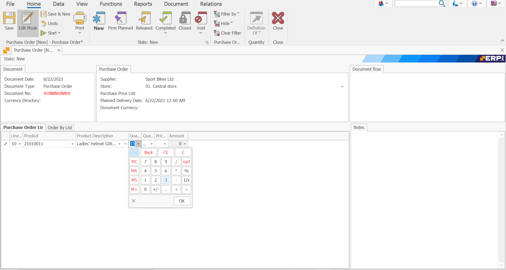
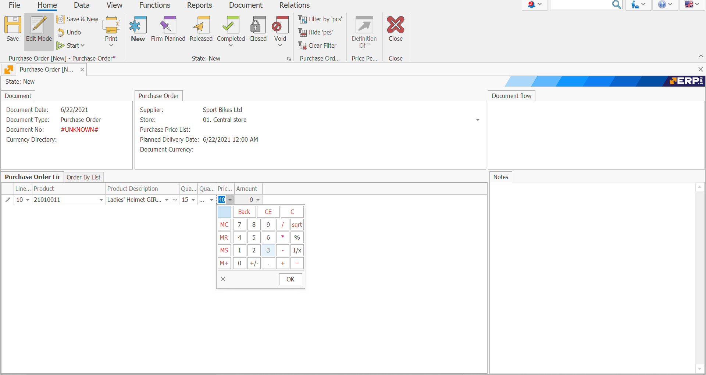
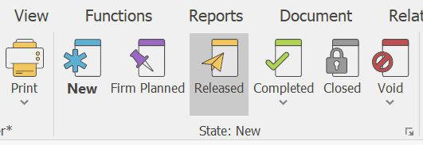

# Purchase Order

The Purchase Order document is used to procure certain goods, products and materials by purchasing from an external supplier.

To create Purchase Order go to <b> Logistics >> Procurement >> Create New Purchase Order </b>

 

Fill in the following fields:

-	<b>Supplier</b> - from which supplier it is planned to buy the goods
 

-	<b>Store</b> - in which store the goods should be credited.
 

-	<b>Document Number</b> - indicate the number of the purchase order, if known.
 

-	<b>Product code</b> - select the product for purchase.
 

-	<b>Product name </b>- when filling in the code, the name is filled in automatically.

-	<b>Quantity </b>- the quantity purchased.
 

-	<b> Measurement Unit Name </b> - the unit of measure of the quantity purchased.
 

-	<b>Unit price</b> - the unit price of the quantity purchased. 
 

-	<b>Amount to pay</b> - the default value is the product of unit price and quantity. If you enter a value in the “Amount to Pay” field, then the unit price will be recalculated.
 

After filling in the data, release the document.
 

In the standard operating model, the system is set to continue with Receiving Order.

To view all issued Purchase Orders, go to <b>Logistics >> Procurement >> Purchase Orders Navigator </b>

-	Press the **Display** Button

-	A list of all Purchase orders created will appear.
 

-	By double-clicking on the selected order you can open it to view it.

