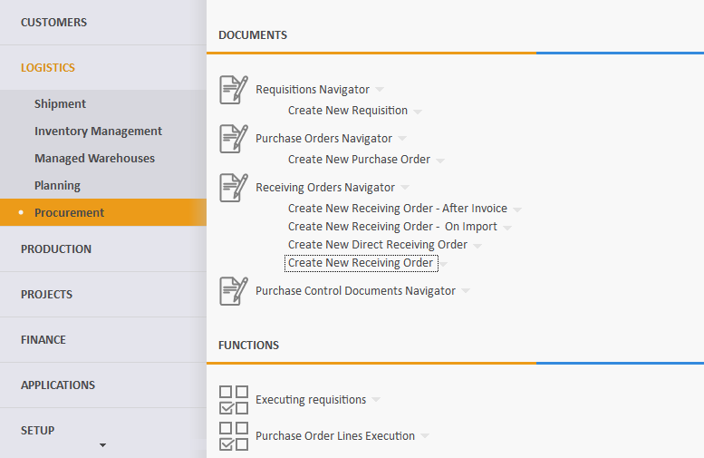
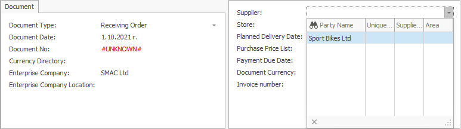
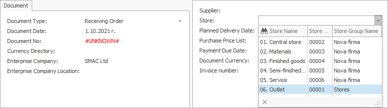
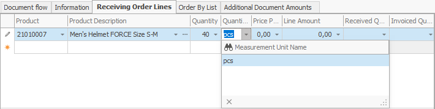
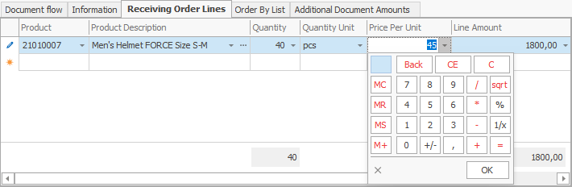
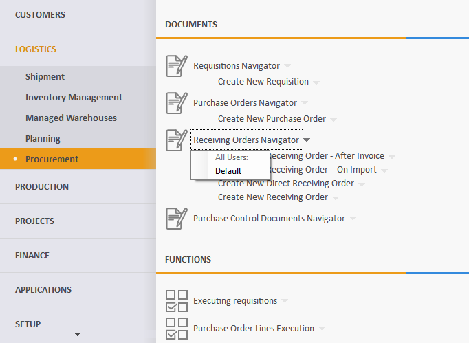

# Receiving order

A receiving order document reflects purchases made by a supplier and aims to increase availability. 

Most often, it is created as a result of a **[purchase order](https://docs.erp.net/winclient/step-by-step/purchase-order.html)**.

To create a receiving order, go to <b>Logistics >> Procurement >> Create new receiving order</b>.
 

Let's fill in the following fields:

- <b>Supplier</b> - this is the supplier from which you plan to buy the goods.
 

-	<b>Store</b> - this is the store in which the goods will be credited.

If the field is left blank, a store can be found for each item in the **Receiving order lines** panel.
 

-	<b>Document No</b> - here, indicate the number of the purchase order, if available.
 

-	<b>Product code</b> - from the dropdown, select the product for purchase.

-	<b>Product name </b> - if you choose the code, this name is generated automatically.
 

-	<b>Quantity</b> - this is the purchased quantity.
 

-	<b>Measurement unit name</b>- here, indicate the unit of measure for the purchased quantity.
 

-	<b>Unit price</b> -  this is the price unit of the purchased quantity.
 

-	<b>Amount to pay </b> - by default, this is a **product** of the unit price and the quantity. 
	
Other values lead to a **recalculation** of the unit price.
 

After filling in the data, **release** the document.
 

- To view all issued receiving orders, press the **Display** button.

- A list of **all** receiving orders will appear.
 

If you click the selected order, you can open and view it.

