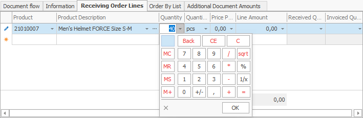

# Receiving Order

A Receiving Order document **reflects** purchases made by a supplier and aims to **increase** availability. 

Most often, it is created **as a result** of a [Purchase Order](https://github.com/ErpNetDocs/winclient/blob/master/step-by-step/purchase-order.md).

To create a Receiving Order, go to <b>Logistics >> Procurement >> Create New Receiving Order</b>.
 

Let's fill in the following fields:

- <b>Supplier</b> - this is the supplier from which you plan to buy the goods.
 

-	<b>Store</b> - this is the store in which the goods will be credited.

If the field is left blank, a store can be found for each item in the **Receiving Order Lines** panel.
 

-	<b>Document No</b> - here, indicate the number of the purchase order, if available.
 

-	<b>Product code</b> - from the dropdown, select the product for purchase.

-	<b>Product name </b> - if you choose the code, this name is generated automatically.
 

-	<b>Quantity</b> - this is the purchased quantity.
 

-	<b>Measurement Unit Name</b>- here, indicate the unit of measure for the purchased quantity.
 

-	<b>Unit price</b> -  this is the price unit of the purchased quantity.
 

-	<b>Amount to pay </b> - by default, this is a **product** of the unit price and the quantity. 
	
Other values lead to a **recalculation** of the unit price.
 

After filling in the data, **release** the document.
 
.png)

- To view all issued Receiving Orders, press the **Display** button.

- A list of **all** Receiving orders will appear.
 

If you **double-click** the selected order, you can open and view it.

