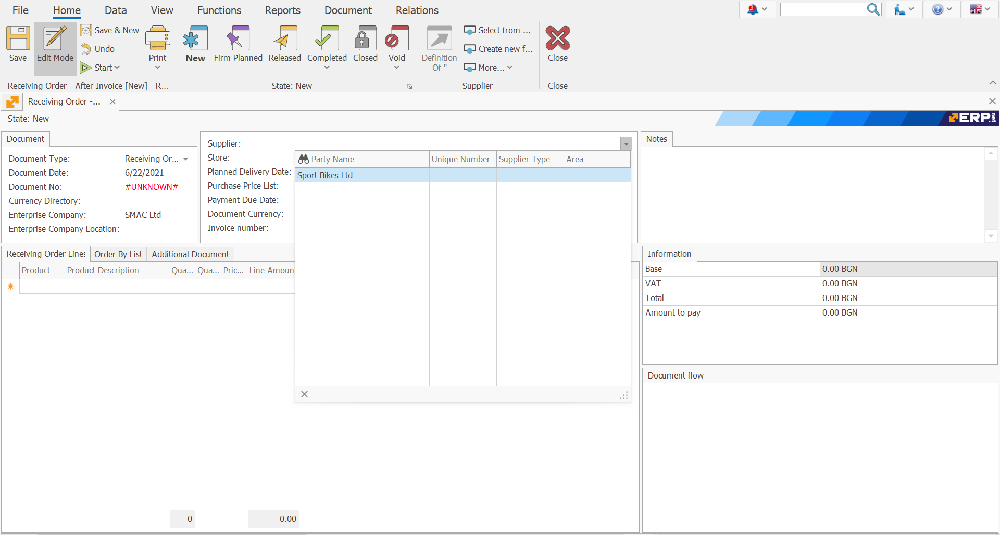

# Receiving Order

A Receiving Order document reflects a purchase made by a supplier and aims to increase availability. Most often the Receiving Order is crated as a result of a Purchase Order (link)

To create Receiving Order, go to <b>Logistics >> Procurement >> Create New Receiving Order </b>
 

Fill in the following fields:
-	<b>Supplier </b> -  from which supplier it is planned to buy the goods.
 

-	<b>Store</b> - in which store the goods should be credited. Alternatively, the field can be left blank, and in the Receiving order lines panel, there will be a store for each item separately. 
 

-	<b>Document Number</b> - indicate the number of the purchase order, if known.
 

-	<b>Product code</b> - select the product for purchase.
-	<b>Product name </b>- when filling in the code, the name is filled in automatically.
 

-	<b>Quantity</b> - the quantity purchased.
 

-	<b>Measurement Unit Name</b>- the unit of measure of the quantity purchased.
 

-	<b>Unit price</b> -  the unit price of the quantity purchased.
 

-	<b>Amount to pay </b>- the default value is the product of unit price and quantity. If you enter a value in the “Amount to Pay” field, then the unit price will be recalculated.
 

## After filling in the data, Release the document.
 

## To view all issued Receiving Orders:

-	Press the Display Button.

-	A list of all Receiving orders created will appear.
 

-	By double-clicking on the selected order you can open it to view it

