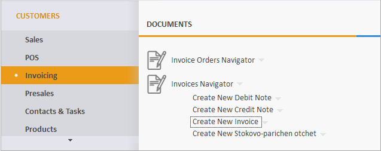

# Sales invoice

A sales invoice document can be created from an **[invoice order](https://docs.erp.net/winclient/step-by-step/invoice-order.html)** or through the **Invoicing Navigator**.

To create a sales invoice from an invoice order, open the sale for which you want to place an invoice.

-	In the **Document Flow** panel, find the sales invoice. 
 

- Right-click to open it.

- The Sales Invoice will open.

-	From the **Command** bar, go to the **Relations** tab and click the **Create Child Document** button.

- Select **Invoice**.

-	The generated invoice will be displayed on the screen.
 

-	**Release** the document.
 

-	Press the **Print** button in order to print the invoice.

To create an invoice, go to **Customers >> Invoicing** and click the **Create New Invoice** button.

  
- You can see a list of uninvoiced items provided for future invoicing. They are created through publiushed invoice order documents, to which no invoice has been issued.
  
- Tick the **Invoicing** column for the lines you want to create an invoice for.
  
-	Click the **Create Invoice** button. 
 

  
-	The generated invoice will be displayed on the screen. 

  
- **Release** the invoice.
 

  
-	Press the **Print** button in order to print the invoice.
 

To view all issued invoices, go to **Customers >> Invoicing >> Invoices Navigator** and click the down ribbon.

- A dropdown list of all issued invoices will appear.

 
      
- If you click the selected invoice, you can open and view it.

