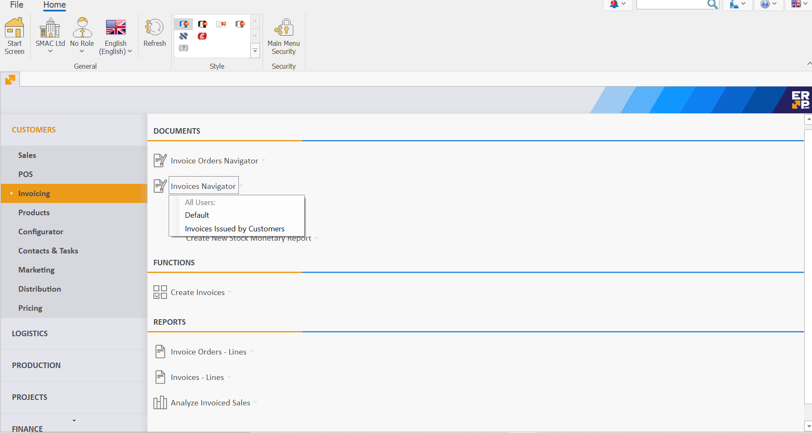

# Sales Invoice

A Sales Invoice document can be created **from** an [Invoice Order document](https://github.com/ErpNetDocs/winclient/blob/master/step-by-step/invoice-order.md) or **through** the Invoicing navigator.

To create a Sales Invoice document from an **Invoice Order document**, open the Sale for which you want to place an Invoice.

-	In the **Document Flow** panel, find the Sales Invoice.

-	Right-click to open it.

-	From the **command bar**, go to the **Links tab** and click the **Create Invoice** button.

-	The generated invoice will be displayed on the screen. After filling in the data, **release** the document.

-	Press the **Print** button in order to print the invoice.

To create an Invoice through the **Invoicing Navigator**, go to <b>Customers >> Invoicing >> Invoicing</b>.
  
- Click the **Display** button.
  
- You can see a list of uninvoiced items provided for **future** invoicing. They are created through **Published Invoice Order** documents, to which no invoice has been issued.
  
- Tick the **Invoicing column** for the lines for which you want to create an invoice.
  
-	Click the **Create Invoice** button. 
  
-	The generated invoice will be displayed on the screen. 
  
- **Release** the invoice.
  
-	Press the **Print** button in order to print the invoice.

To view all issued invoices, go to <b>Customers >> Invoicing >> Invoices Navigator</b>.
  
- Click the **Display** button.
  
- A list of **all** issued invoices will appear.
  
 

If you double-click the selected invoice, you can open and view it.

