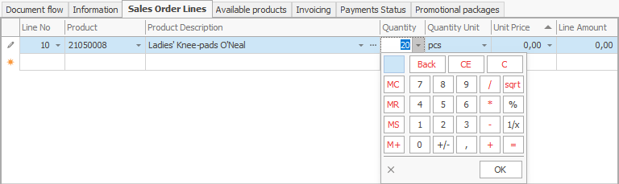

# Sales order

A sales order document is intended for the selling of goods to customers.

To create it, go to **Customers >> Sales >> Create new sales order**
 

Let's fill in the following fields:

-	<b>Customer</b> - from the dropdown, choose the customer you're going to sell to. 
 

-	<b>Store</b> - you can fill in the field in the **header** of the document, or you can fill it in the **sales rows**, for each row separately.
 

-	<b>Product code </b> - from the dropdown, select the product for sale.

-	<b>Product name</b> - if you choose the code, this name is generated automatically.
 

-	<b>Quantity</b> - this is the sold quantity.
 

-	<b>Measurement unit name</b> - here, indicate the unit of measure of the sold quantity.
 

-	<b>Unit price</b> - this is the price unit of the sold quantity.
 

-	 <b>Amount to pay</b> - by default, this is a **product** of the unit price and the quantity. 
	
Other values lead to a **recalculation** of the unit price.
 

After filling in the data, **release** the document.
 

In the standard operating model, the system is set to continue with an **[invoice order](https://docs.erp.net/winclient/step-by-step/invoice-order.html)**.

To view all issued Sales, go to **Customers >> Sales >> Orders navigator**.

- Press the **Display** button.

- A list of **all** issued sales will appear.

If you **double-click** the selected sale, you can open and view it.

