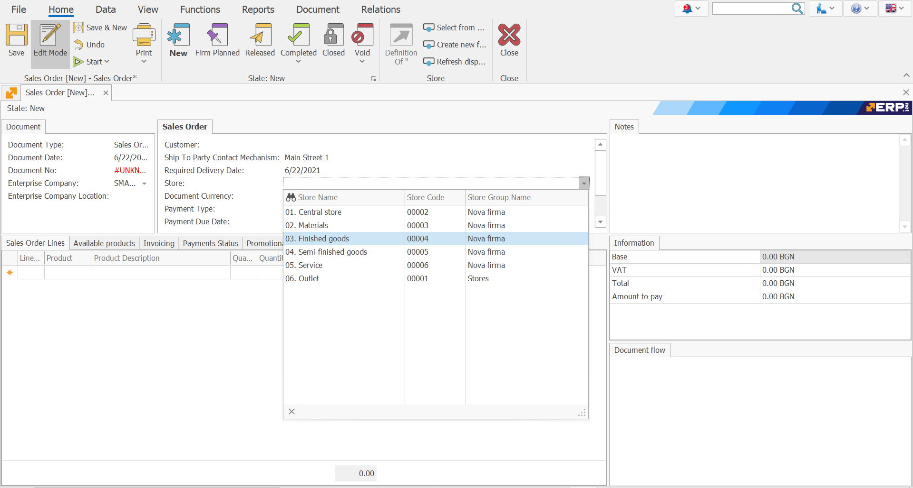

# Sales Order

Sales Order is a document, intended for the sale of goods to customers.

To create a sale order go to <b> Customers >> Sales >> Create New Sales Order </b>
 

Fill in the following fields:

-	<b> Customer </b>- from the drop-down list, select the customer you are selling to. 
 

-	<b> Store </b> -  you can fill in the field in the header of the document, or you can fill in the sales rows, for each row separately.
 

-	<b>Product code </b>- select the product for sale.

-	<b>Product name</b> - when filling in the code, the name is filled in automatically.
 

-	<b>Quantity</b> - the quantity sold.
 

-	<b>Measurement Unit Name</b>- the unit of measure of quantity sold.
 

-	<b>Unit price</b> - the unit price of the products sold.
 

-	 <b>Amount to pay</b> - the default value is the product of unit price and quantity. If you enter a value in the “Amount to pay” field, then the unit price will be recalculated.
 

## After filling in the data, Release the document.
 

In the standard operating model, the system is set to continue with an Invoice Order.

## To view all issued Sales:

Go to <b>Customers >> Sales >> Orders Navigator </b>

- Press the Display Button.

- A list of all issued sales will appear.

- By double-clicking on the selected sale you can open it to view it.

